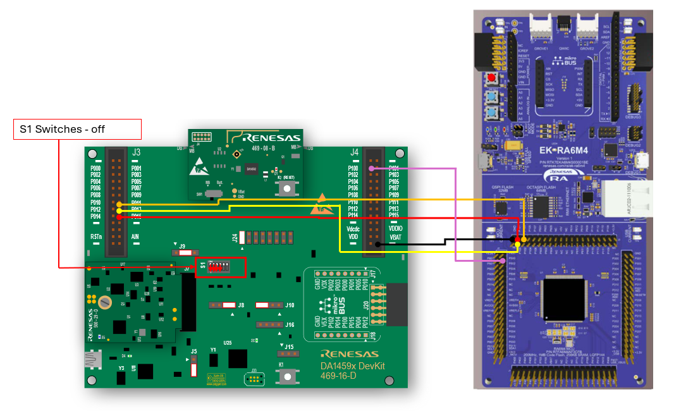
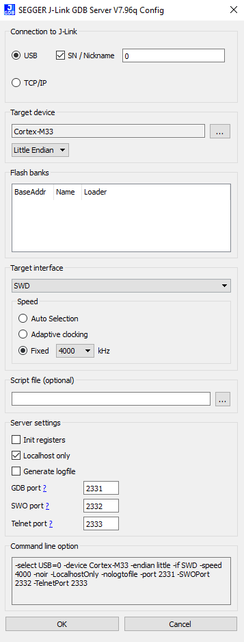

# RA6M4 MCU Boot Image Update over DSPS (BLE)

This project demonstrates how to perform secure and high-speed firmware updates on a Renesas RA6M4 MCU using the MCUBoot bootloader over Bluetooth Low Energy (BLE) via the Dialog Serial Port Service (DSPS) protocol. The example extends the traditional MCUBoot xmodem UART flow to support wireless image delivery from a DA14592 module running DSPS.

---

## 🔍 Overview

This implementation:
- Leverages MCUBoot as the secure bootloader
- Uses the DSPS protocol over BLE for data transport
- Optimizes for high-speed firmware update performance
- Supports both internal dual-bank flash and external QSPI memory

---

## 📚 References

- **MCUBoot App Note**: [RA6 MCU Advanced Secure Bootloader Design using MCUBoot and Code Flash Dual-Bank Mode](https://www.renesas.com/en/document/apn/ra6-mcu-advanced-secure-bootloader-design-using-mcuboot-and-code-flash-dualbank-mode?r=1333976)
- **Dialog DSPS SDK**: [Serial Port Service (SPS)](https://www.renesas.com/en/software-tool/serial-port-service-sps)

---

## 🧰 Required Hardware

- **RA6M4 Evaluation Kit**  
  [EK-RA6M4 Product Page](https://www.renesas.com/en/design-resources/boards-kits/ek-ra6m4#design_development)
- **DA14592 Pro Kit**  
  [DA14592-016FDEVKT-P Product Page](https://www.renesas.com/en/design-resources/boards-kits/da14592-016fdevkt-p#parametric_options)
- **Mobile Device with BLE Support**  
  - Install **Renesas SmartConsole** from iOS App Store or Google Play

---

## 🗂️ Project Contents

The repository includes:
- Full **source code** for bootloader and demo applications
- Pre-built **binaries** located in the `artifacts/` directory
- QSPI-encoded and internal flash demo images

---

## ⚙️ Hardware Setup

### 🔌 Wiring: RA6M4 to DA14592

| RA6M4 Pin | DA14592 Pin |
|-----------|-------------|
| GND       | GND         |
| P103      | P011        |
| P100      | P013        |
| P101      | P015        |
| P800      | P100        |

### 🧾 DA14592 DIP Switches

- On the DA14592 board, locate **S1** (center-left).
- Set the **first four DIP switches to OFF** (toward the bottom edge).



---

## 🧪 DA14592 DSPS Firmware Programming

1. Connect the DA14592 motherboard via USB.
2. Launch **J-Link GDB Server**:
   - Target: `Cortex-M33`
   - Interface: `SWD`, Little Endian
   - Confirm that "J-Link Connected" appears.

     

3. Open a terminal in the `artifacts/DA14592/` directory and run:

    ```bash
    ./cli_programmer.exe gdbserver chip_erase_eflash
    ./cli_programmer.exe gdbserver write_eflash 0 sps_peripheral_2M_PHY_15_MS.bin
    ```

4. Press the **green reset button** on the DA14592 daughtercard.

5. Open **Renesas SmartConsole** on your mobile device and confirm you see `Renesas SPS Demo` advertising.

---

## 🧩 RA6M4 Initial Image Programming

1. Open **J-Flash Lite**:
   - Device: `R7A6M4AF`
   - Interface: `SWD`
   - Frequency: `4000 kHz`

2. Select **Erase Chip**.

3. Use the file browser (`...`) to select your image:
   - For QSPI: `artifacts/QSPI_Enc/xxx_demo_initial_image_qspi.hex`

4. Click **Program Device**.

5. Press the **red reset button** on the RA6M4 board.

6. You should see **3 LEDs blinking**, indicating bootloader + app are ready.

---

## 📱 Uploading the Update Image via SmartConsole App

1. **Add the update image to the app**:
   - If using iOS:
     - Open iTunes → File Sharing
     - Select **SmartConsole** and upload the binary (e.g., `app_secondary_image_qspi_enc.bin`)

2. In the app:
   - Connect to `Renesas SPS Demo`
   - You should see: `UART DSPS MCU Boot Downloader Start`

3. In the hamburger menu (☰), select **Data File Streaming**:
   - Tap **Touch to select file** → choose the update binary
   - Set:
     - **Chunk size**: `244`
     - **Interval**: `1 ms`
   - Tap **Start**

4. For QSPI demos, expect a short pause around **2%** (QSPI erase).

5. Upon completion:
   - The RA6M4 will reset
   - Only the **Blue LED** should blink

---

## ⚡ Performance

| Configuration                  | Image Size | Transfer Time (iOS ≥ iPhone 11) |
|-------------------------------|------------|-------------------------------|
| Dual Bank (Internal Flash)    | ~460 KB    | ~7 seconds                    |
| QSPI Encrypted (QSPI_Enc)     | ~918 KB    | ~23 seconds                   |

> ⏱️ QSPI transfers are slower due to full-chip erase latency.

---

## 📦 Artifacts

All necessary binaries to run the demo are in the `artifacts/` folder:

```
artifacts/
├── DA14592/
│   └── sps_peripheral_2M_PHY_15_MS.bin
├── QSPI_Enc/
│   ├── xxx_demo_initial_image_qspi.hex
│   └── app_secondary_image_qspi_enc.bin
└── ...
```

You can run the demo without rebuilding from source.

---

## 🧑‍💻 License

This project is provided under the **MIT License** unless otherwise noted.

---

## ❓ Support

For questions, bug reports, or contributions, please reach out to [your.team@email.com] or open an issue in this repository.
